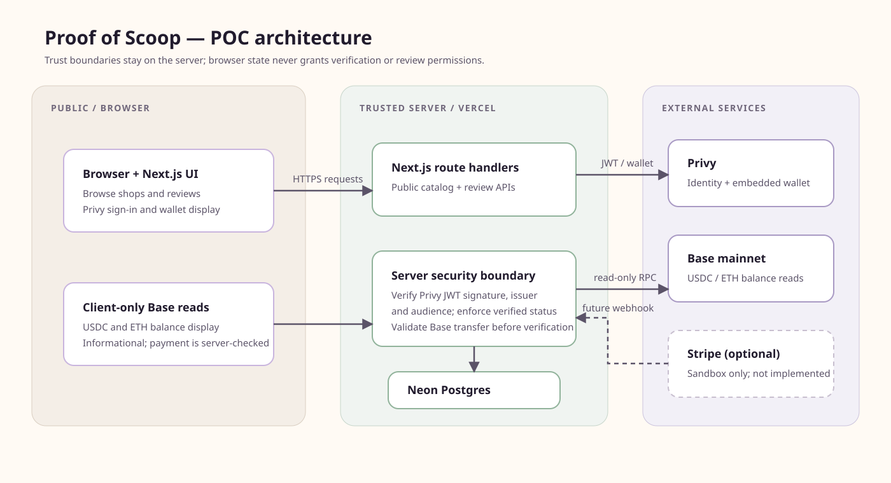

# Proof of Scoop

Proof of Scoop is a small consumer ice-cream directory. Anyone can browse and
read reviews; verified contributors can submit one. The POC deliberately keeps
the Web3 details behind a normal consumer experience.

Demo walkthrough available here: https://www.youtube.com/watch?v=ICM6faXX10g

## Current status

The POC currently supports public shop browsing, Privy sign-in, embedded-wallet
display, server-side access-token verification, development-only mock
verification, and verified-only review submission. Mock verification does not
charge money, move USDC, or prove an on-chain payment.

For the Issue #2 Privy account shell, set `NEXT_PUBLIC_PRIVY_APP_ID` in `.env.local`, enable email login and Ethereum embedded wallets in Privy, and add your local/deployed origins before testing sign-in.

## Local development

1. Use Node.js 22 or later.
2. Copy `.env.example` to `.env.local` and fill only the values needed by the
   issue you are working on. Do not commit `.env.local`.
3. Install dependencies with `npm install`.
4. Start the app with `npm run dev`.

Useful checks:

```bash
npm run lint
npm run typecheck
npm test
npm run build
```

## Architecture direction

The intended POC flow is:

```text
Browser → Next.js app → server-side Privy token verification → Postgres
                 ↘ Privy embedded wallet → Base USDC balance/transaction check
```

Privy authenticates users. The database owns application permissions, keyed by
the Privy DID; a wallet address is an attribute, never the primary user ID.

## Scope

The POC proves sign-in, embedded-wallet creation, internal user records,
balance display, verification status, and verified-only reviews. It does not
include rewards, treasury payouts, reputation, voting, referrals, staking,
smart contracts, or production tax logic.

See [plan.md](./plan.md) for the implementation order and [UserToDo.md](./UserToDo.md)
for the external account setup required when deploying a fork.

## Routes and data model

| Route | Purpose | Access |
| --- | --- | --- |
| `/` | Landing page | Public |
| `/shops` | Seeded shop directory | Public |
| `/shops/[slug]` | Shop details, reviews, and review form | Public reads; verified users write |
| `/account` | Privy identity, embedded wallet, and balances | Sign-in for account data |
| `/verify` | Development mock verification | Non-production only |

The database stores `users`, `shops`, `reviews`, and `verification_events`.
Privy DIDs identify application users; wallet addresses are attributes. API
route handlers verify Privy access-token signatures server-side and enforce
verification status before creating reviews. Browser state, wallet addresses,
and client-provided verification claims are never authorization boundaries.



Follow [docs/DEMO.md](./docs/DEMO.md) for the repeatable browser walkthrough.

## Vercel deployment

The app uses standard Next.js deployment behavior and does not require a
`vercel.json`. Connect the repository to a Vercel project, then add these
variables in Vercel for both Preview and Production:

- `NEXT_PUBLIC_APP_URL` — the exact deployed HTTPS origin for that environment.
- `NEXT_PUBLIC_PRIVY_APP_ID` — safe to expose to the browser.
- `NEXT_PUBLIC_VERIFICATION_RECIPIENT_ADDRESS` — the public Base address that receives the $1 verification payment.
- `PRIVY_JWT_VERIFICATION_KEY` — server-only PEM or JSON JWK.
- `DATABASE_URL` — server-only pooled Neon connection string.
- `BASE_RPC_URL` — optional server-only Base mainnet RPC endpoint.

Do not add `PRIVY_APP_SECRET` unless a future server-side Privy API integration
needs it; the current app does not read it. Vercel automatically exposes only
variables prefixed with `NEXT_PUBLIC_` to browser bundles.

After setting variables, deploy or redeploy the project. In Privy, add the
Preview URL and Production URL to the app's allowed origins and enable “Return
user data in an identity token” under User management → Authentication →
Advanced. Preview URLs are deployment-specific, so add the stable Vercel
project domain as well if it is used for review. Then test public browse,
sign-in, account/wallet display, the real Base verification flow, and the
verified review flow over HTTPS.

Hosted verification is operator-dependent when Vercel Hobby team/project
features or deployment access are unavailable. Run the local checks below and
record any unverified hosted step in the issue or pull request.

## Database migrations and seed data

With `DATABASE_URL` set in a local, non-committed `.env.local`, run the checked-
in migration command once before the first deployment, then seed the catalog:

```bash
npm run db:migrate
npm run db:seed
```

Migrations are applied in numeric filename order, each file in its own
transaction. Deploys do not run migrations automatically. The seed command is
idempotent: it updates the six stable shop slugs instead of creating
duplicates.

See [DEPLOYMENT.md](./DEPLOYMENT.md) for the complete release checklist.

## Limitations and deferred work

- Mock verification is disabled in production and is not a payment proof.
- Real verification requires a user-funded Base mainnet wallet, exactly 1 USDC,
  Base ETH for gas, and a configured recipient address. Balance reads remain
  informational.
- Stripe Crypto Onramp is optional and not integrated; sandbox funds must not
  be described as real or spendable USDC.
- Rewards, payouts, reputation, anti-Sybil controls, referrals, staking, and
  smart contracts are outside this POC.
